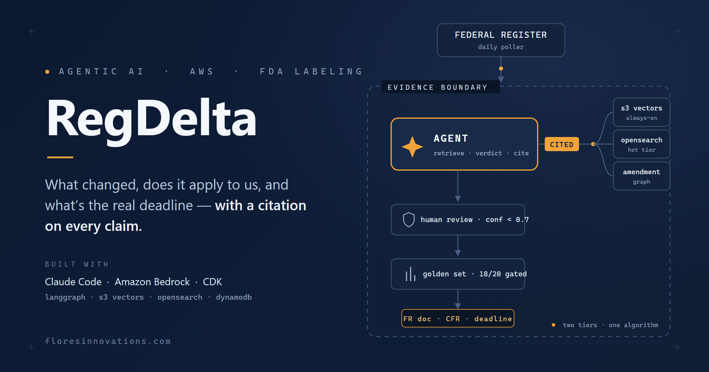
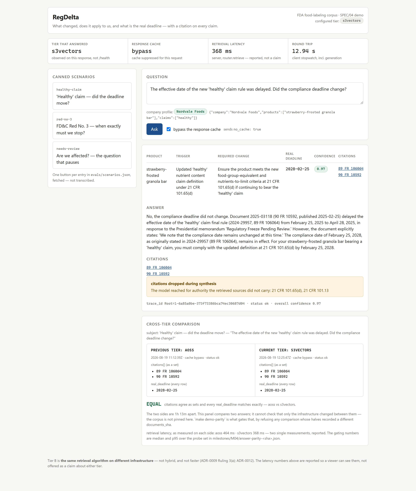

# RegDelta

**FDA changes a food-labeling rule. RegDelta answers "what changed, does it
apply to us, and what's the real deadline?" — with a citation on every
claim.**

An agentic regulatory-change assistant built milestone-by-milestone with
Claude Code. Every milestone is tagged, scored against a fixed golden
question set, and journaled — the repo history IS the demo.

**Live demo:** https://d2rdgeiujg622n.cloudfront.net ·
**5-minute walkthrough:** [docs/demo-walkthrough.md](docs/demo-walkthrough.md)

## What it does, in one answer

The demo's signature question:

> *"The effective date of the new 'healthy' claim rule was delayed.
> Did the compliance deadline change?"*

| | |
|---|---|
| **Product** | strawberry-frosted granola bar |
| **Trigger** | updated 'healthy' implied nutrient content claim, 21 CFR 101.65(d) |
| **Required change** | meet the food-group-equivalent and nutrients-to-limit criteria |
| **Real deadline** | **2028-02-25 — it did not move** |
| **Confidence** | 0.97 |
| **Citations** | [89 FR 106064](https://www.federalregister.gov/d/2024-29957) · [90 FR 10592](https://www.federalregister.gov/d/2025-03118) |

Why this is hard: FDA delayed the rule's *effective* date (Feb 25, 2025 →
Apr 28, 2025). A naive reader — human or RAG — slides the compliance deadline
forward with it. It did not move: the delaying document says, in terms, *"the
compliance date remains unchanged at this time"*, and the answer quotes that
sentence back with the citation.

**The score, stated the honest way:** on the same 20-question golden set over
the same corpus, naive RAG scores **4/20**; the agent scores **18/20**, on
both retrieval tiers, identically. The two misses (q12, q15) are documented
defects with triage write-ups (`milestones/M07/q12-q15-triage.md`) — recorded,
not rounded away.

## How it works, in one screen

Two design decisions carry most of the quality:

- **Timeline questions never touch vector search.** Effective dates,
  compliance dates, stays and supersessions are answered from a DynamoDB
  amendment graph — SUPERSEDES and CONFIRMS edges scoped to
  `effective_date` / `dates_confirmed`, extracted at ingest. The answer
  above is read from two of those rows, not inferred from a similarity
  match.
- **Below 0.7 confidence, it refuses to answer.** "Are we affected?" with no
  company profile attached renders **NEEDS HUMAN REVIEW** and mints a resume
  token instead of guessing. In compliance, confidently wrong is worse than
  slow.

And one phrasing rule the repo enforces on itself: the second tier is the
**same retrieval algorithm on different infrastructure** — not hybrid
(measured worse than vector-only, ADR-0009) and not faster (measured and
retired as a justification, ADR-0012). Its remaining case is concurrency.

## The evidence trail

Everything below is the audit trail: every number links to a recorded
artifact in `milestones/M*/` or `evals/history/`, and the footnotes are
load-bearing — read them before quoting a row.

## Progression

| M | Milestone | Tag | Traps (q01-q04) | Overall | Status |
|---|-----------|-----|-----------------|---------|--------|
| 00b | Naive-RAG baseline (the control) | `m00b` | 1/4 * | 30% | ✅ |
| 01 | Ingestion + amendment graph | `m01` | n/a | n/a | ✅ |
| 02 | Two-tier retrieval (S3 Vectors / AOSS) | `m02` | n/a ** | 9/9 probes ** | ✅ |
| 03 | Agent graph + HITL | `m03` | 4/4 | 100% *** | ✅ |
| 04 | API + demo UI | `m04` | 4/4 | 90% **** | ✅ |
| 05 | Deploy + lifecycle | `m05` | 4/4 | 90% \*\*\*\*\*\*\* | ✅ |
| 06 | Load + observability | `m06` | 4/4 | 90% \*\*\*\*\* | ✅ |
| 07 | Governance layer (three doors) | `m07` | 4/4 | 90% \*\*\*\*\*\* | ✅ |

Fill each row at milestone close (see .claude/skills/close-milestone).

\* The baseline's single trap "pass" (q03) is **not earned** — the question
leaks its own answer token and has no TTB source in the corpus to retrieve.
Recorded as-run per SPEC/00b's "if the traps pass, the questions are too
easy — record it" clause; a tightening is drafted and awaiting SME approval
(milestones/M00b). M01 has no eval row because the golden set needs an
answering endpoint, which is SPEC/04.

\*\* **M02's number is not comparable to the rows above it, and must not be read
as a delta.** "9/9 probes" is `recall@8 = 1.0` on both retrieval tiers over the
9-probe retrieval set — a *retrieval* measurement at the `router.retrieve()`
contract. It is not answer quality, so it is not a delta against M00b's 30%;
every scorecard carries `"comparable_to_baseline": false` and SPEC/02's "No trap
score" rule bars a trap column here. The golden set still needs SPEC/04's
answering endpoint, which is why the traps column reads n/a rather than 0/4.
Evidence: `evals/history/b16f596-retrieval-{s3vectors,aoss}.json`, gated by
`make retrieval-parity`.
Two things M02 recorded rather than resolved: Tier B's **hybrid** retrieval
measured *worse* than vector-only (7/9 vs 9/9), so the lexical lane is off
(ADR-0009 Ruling 3(a)); and Tier B's replacement justification — latency — is
**unmeasured**, owed to SPEC/04, with ADR-0001 amended to reopen if it shows no
advantage.
\*\*\* **M03's 100% is against a re-run control, not against the 30% above it.**
The M00b row was recorded on a different instrument: four of the ten golden
questions have been rewritten since (q03 and q07 on 2026-08-12, q02 and q08 on
2026-08-15, each under an SME-seat ruling with sources), and the corpus has
grown from 4 FR documents to 49. So the control was **re-run at M03's own
commit, against M03's questions, over M03's corpus** — `naive` scores **4/10,
traps 2/4** there, and the agent scores **10/10, traps 4/4**. That is the
delta this row claims. Re-running the control is not improving it (ADR-0002);
`src/baseline/naive.py` is untouched. Evidence:
`evals/history/ac839ca-{naive,s3vectors}-full.json`, both recorded from a
clean tree, both carrying the corpus fingerprint that makes them comparable.
The corpus changed *during* the closing session — 34 documents to 49 — which
is why that fingerprint now exists (ADR-0011).

\*\*\*\* **M04's 90% is against a control re-run at M04's own corpus**, the
same discipline as the row above. All three cards carry corpus fingerprint
`35a293e17117` (52 documents) and the same twenty questions: `naive` scores
**4/20, traps q01-q04 0/4**; the agent scores **18/20, traps 4/4 — on BOTH
tiers**, S3 Vectors and AOSS, identically. Re-running the control is not
improving it (ADR-0002); `src/baseline/naive.py` is untouched on this branch.
Evidence: `evals/history/6fad8f6-naive-full.json` and
`evals/history/1fa942a-{s3vectors,aoss}-full.json`.

The control card sits two commits after the agent cards, and that gap is inert:
those two commits change only `evals/serve_local.py`, the offline shim, which
the deployed API does not use — the agent cards were measured against the
deployed API. What the gap fixed is why it exists at all: **the control had
become unrecordable.** `cache_control_violations`, added at `e9ba788` to stop a
Tier B scorecard reading 5/5 from Tier A's cached answers, rejects any response
whose cache state is not one of `bypass|disabled|uncacheable` — and the shim
emitted no cache state at all, so every naive answer was refused. Nothing
noticed for three days because nothing re-ran the baseline. A guard written to
protect card honesty had silently disabled the one card ADR-0002 makes every
other claim a delta against.

The two failures are `q12` and `q15`, both **deferred by the human seat with
evidence** and neither in a gated subset (milestones/M04). The 90% is 18/20 with
those two standing, not a rounded 20/20.

**Read the trap column carefully.** The naive control's trap score is not
stable: it scored 4/8 on the traps subset at `2cea737` and 2/8 here, on the same
frozen code. The `q01-q04` column reads 0/4 both times. A control that varies
run to run is a control whose single-run delta is worth less than the direction
it shows — recorded rather than smoothed over.

\*\*\*\*\* **M06's 90% is the same 18/20 as M04's, and that is the point** — this
milestone measured infrastructure, not answers. Both tiers score 18/20 at
`95235d9` on the same corpus fingerprint `35a293e17117`, failing the same
deferred `q12` and `q15`. Evidence:
`evals/history/95235d9-{aoss,s3vectors}-full.json`.

Two things this row does not say on its own. **S3 Vectors reads 17/20 → 18/20
against M05 and that is not progress**: M05's third failure was `q03`, which
landed PASS this time — the same non-determinism the SME seat ruled on at M05,
resolving the other way. And **the suite is red at close by seat decision** —
three q03 FRAGILE tests, as at M05; `replay_history` reports exactly one FRAGILE
and zero REGRESSED.

What M06 actually decided is **Tier B's disposition: KEPT**, on the bar ADR-0012
fixed before any M06 number existed — AOSS p95 185.9 ms against S3 Vectors'
281.4 ms at 50 calls/s. The verdict is bounded to 10–50 calls/s and says nothing
about the 11.4–25.8 in-flight band the real workload applies; M07 measures that.
See ADR-0014 and `milestones/M06/tier-disposition-f651aea.json`, judged at
`f651aea` (tag `m06-disposition`, because the squash does not preserve it).

The intended arc: baseline fails the trap questions → retrieval fixes
recall → the agent graph fixes the traps → the rest makes it production-
shaped. Evidence lives in milestones/M*/ and evals/history/.

\*\*\*\*\*\* **M07's 90% is the same 18/20 as M06's and M04's, and that is
the correct result.** M07 is a governance milestone: it added a ground-truth
gate, made `golden-set` and `ruling-cited` required, and removed the admin
bypass. It changed no retrieval code, no prompt and no ground truth except the
six q12 accept tokens an SME-seat ruling deleted for admitting the answer the
question excludes (`milestones/M07/q12-token-ruling.md`) — a change that makes
the set STRICTER. **A governance milestone reporting a score improvement would
be reporting either a coincidence or a gate that had started grading itself.**

The two misses are `q12` and `q15`. Both were triaged from the SME seat and
**ground truth was upheld on both** (`milestones/M07/q12-q15-triage.md`): q12's
answer-composition layer inverts a verdict sentence it has already reasoned
correctly, and q15's retrieval embeds one raw query at `NAIVE_TOP_K = 8` with
no decomposition. Real defects, each owed its own milestone. Neither gates,
because neither has ever passed in any recorded run — which is what the
regression bar ruled at M07 means (`milestones/M07/eval-gate-bar-ruling.md`).

What M07 actually decided is that **the repository owner is subject to the
rules**: `bypass_actors` is `[]` and `current_user_can_bypass` is `never`, so a
red required check has no override and the only recourse is a fix or a re-run.
That was demonstrated three times against real pull requests — Door 1 (#20)
blocked, Door 3 (#21) blocked by review AND by tests, Door 2 (#17 → #18)
merged clean by doing it properly. Evidence:
`milestones/M07/doors/`, `ruleset-after-bypass-removal.json`.

And it decided one thing it did not set out to: **the gate caught a defect in
this milestone's own work.** `golden-set` blocked a documentation-only pull
request twice on q05. That was diagnosed as flake, then as non-determinism,
then as Bedrock load, then as completion length — all four wrong. The metrics
say the verdict call SUCCEEDED both times and `_json_object` could not parse a
complete reply, so the answer collapsed to empty at confidence 0.00. The gate
was right; the product was not. `milestones/M07/q05-mechanism.txt`.

\*\*\*\*\*\*\* **M05's row was filled two months late, and the delay is the
interesting part.** M05 built and deployed the lifecycle — the state-table
split, the janitor's PassRole deletion, the AOSS grant scoped to the collection
ARN, and the hydration gate that refuses a hot tier nobody filled. All four
were measured live on 2026-08-20 and the lifecycle half of SPEC/05's Done-when
passed end to end. The milestone stayed open on one criterion: `make evals`
green, blocked by q03, a question that fails intermittently on a false fail the
SME seat had already ruled on and whose scorer fix was implemented and then
**reverted** because review found it created four false passes where it removed
one false fail (`milestones/M05/q03-ruling.md`).

What unblocked it was not a fix to q03. It was M07's PM ruling that the bar
itself was wrong: `passed == total` had **never been satisfied by any recorded
run in this project's history** (`milestones/M07/eval-gate-bar-ruling.md`). The
gate now fails on a REGRESSION. M05 was then re-run end to end at today's code
rather than closed on its August cards — both tiers green at 18/20, traps 4/4,
q03 passing on both **without being admitted, exempted or rescored**.
Evidence: `milestones/M05/close-verification.txt` and the parity pair
`evals/history/c256b81-{aoss,s3vectors}-full.json`, same commit, same corpus
fingerprint `35a293e17117`, `fallbacks: []` on both so the hot-tier card
measures the hot tier.

Two clauses are recorded as NOT met rather than absorbed into the close: the
"fresh account: bootstrap" path has never been exercised, in August or now; and
`make fault-drop` and the janitor teardown are cited from the 2026-08-20 window
rather than re-measured, since neither depends on the eval bar that held the
milestone open.

## Governance (separation of roles, from the start)
The org chart is encoded in the repo: CODEOWNERS maps files to role seats
(PM owns SPEC/**, the compliance SME owns golden ground truth, Security
owns tool policy + infra, the lead owns CLAUDE.md/ADRs), and role subagents
(.claude/agents/) run first-pass review from each seat.

**CODEOWNERS routes; it does not enforce.** Measured on the live ruleset:
`required_approving_review_count` is 0 and `require_code_owner_review` is
false. What IS mechanically enforced is narrower and is listed in
docs/governance/ROLES.md — a pull request touching an SME-owned eval path
fails `ground-truth-gate / ruling-cited` unless it cites a ruling already on
`main`, and `unit` and `golden-set` are required checks. Since 2026-08-22 the
admin bypass is removed, so those bind the repository owner too. This
paragraph said "branch protection makes those reviews mandatory" until M07
went and read the ruleset (lead+PM ruling,
milestones/M07/roles-amendment-draft.md).

Start here: docs/governance/ROLES.md · demo script:
docs/governance/demo-script.md · setup: docs/governance/branch-protection.md.

## Traceability rules
- One milestone = one branch (`mNN-<slug>`) = one tag at close (`mNN`).
  Branch and tag must NEVER share a name: git cannot disambiguate
  `refs/heads/x` from `refs/tags/x`, so `git push -u origin x` fails with
  "src refspec matches more than one" and `git checkout x` is ambiguous.
- `python evals/run_evals.py --record` after every green run you care
  about — history is append-only JSON keyed by git SHA + tier.
- Consequential choices get an ADR (docs/adr/). Superseded ADRs are
  marked, never deleted.
- milestones/MNN/README.md answers: what can I demo right now, what's the
  delta vs baseline, what broke.

## Quick start
    make bootstrap && make core     # persistent stack (S3 Vectors tier)
    make ingest-backfill            # load the demo corpus
    make evals                      # definition of done
    make up / make down             # ephemeral AOSS hot tier per session

See SPEC/00-overview.md (mission), SPEC/00b (baseline), CLAUDE.md (rules).
